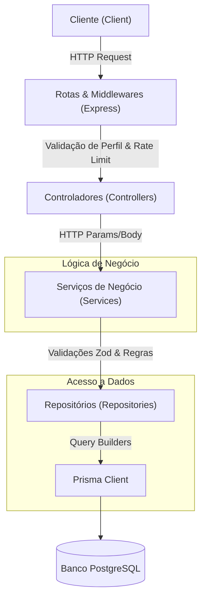
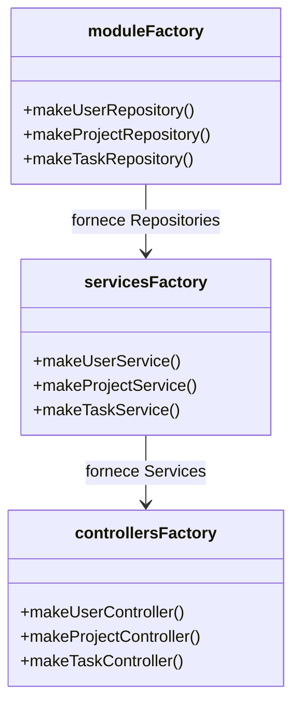

# Arquitetura do Sistema

A **Todo List API** adota uma arquitetura em camadas estruturada em torno de domínios (módulos). Esta abordagem garante alta testabilidade, legibilidade e facilidade de manutenção.

---

## Estrutura do Fluxo de Requisição

Quando uma requisição chega à API, ela trafega sequencialmente através das seguintes camadas:

---

## Descrição Detalhada das Camadas

### 1. Rotas (`Routes`)
Definem os caminhos (endpoints) HTTP e associam middlewares para controle de acesso e proteção:
*   **`authMiddleware`**: Valida a assinatura e validade do token JWT presente no cookie ou cabeçalho.
*   **`roleMiddleware`**: Bloqueia acessos indesejados baseado nos perfis `USER` ou `ADMIN`.
*   **`authRateLimiter` / `globalRateLimiter`**: Protege os endpoints de brute-force e excesso de tráfego.

### 2. Controladores (`Controllers`)
Camada puramente ligada ao ecossistema HTTP. O controlador:
*   Extrai parâmetros de rota (`req.params`), strings de busca (`req.query`) e corpos de requisição (`req.body`).
*   Delega a execução para a camada de serviços.
*   Retorna a resposta JSON padronizada com o status code correto (ex: `200`, `201`, `400`).

### 3. Serviços de Negócio (`Services`)
Contêm as regras de negócio centrais e a integridade de dados do sistema:
*   Verifica posse de recursos (evitando vulnerabilidades de acesso IDOR/BOLA).
*   Executa encriptação de senhas (via Bcrypt).
*   Aplica a lógica de exclusão lógica (soft delete) em cascata.
*   Aciona o serviço de notificações por e-mail.

### 4. Repositórios (`Repositories`)
Abstrai o mecanismo de persistência de dados. Toda interação com o banco usando as chamadas do Prisma é encapsulada nesta camada, permitindo que a camada de serviços permaneça agnóstica em relação a consultas brutas ou sintaxe específica de ORM.

---

## Fábrica de Injeção de Dependências (Factories)

O projeto evita o acoplamento rígido entre classes instanciando as dependências de trás para frente usando o padrão **Factory**.

As fábricas estão localizadas no diretório [src/shared/factories](file:///c:/Users/mathe/Desktop/todo-list-api/src/shared/factories):

### Benefícios desta abordagem:
1.  **Testabilidade**: É possível mockar os repositórios facilmente para testar os serviços em testes unitários.
2.  **Desacoplamento**: Caso mude a assinatura de um repositório ou serviço, a mudança é alterada apenas na factory correspondente, sem espalhar instâncias (`new Service()`) ao longo das rotas do projeto.
